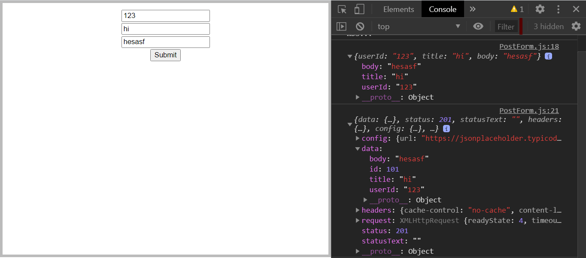

# React and HTTP


- Lets learn How HTTP requests are generally handled in a React application. We need to understand the basic scenarios of making get and post requests from our React application.
- When we build a web application(a React app), we need to reach out to the server to fetch some data or send some data based on user interaction.
- But as we know that React is a library for creating User Interfaces. It is in no way concerned about HTTP. Then ***How do we make AJAX requests in React?*** or ***How do we make API calls in React?***.
- React itself does not have a particular way to fetch or send data to the server. In fact, React doesn't even know that there is a server in the picture.
- React components simply read props and state and render them to the UI. Therefore, to use some data from the server, you just have to get the data into your components' props or state.
- Now, if React isn't going to handle the requests, then who will do that? This is where we will be using an ***HTTP Library***. I prefer to use Axios, you can also use Fetch API.
- Create a new React App and add the Axios package to our application using `npm install axios`.
- We can now start making HTTP requests from our application.

## HTTP GET Request
- Lets make a GET request using Axios and render the fetched data in a React component.
- To fetch the data, we need to have an API endpoint. For that, we will be using [https://jsonplaceholder.typicode.com/](https://jsonplaceholder.typicode.com/)..
- If we scroll down to the Routes section, we can see the possible HTTP requests we can make.
- We will be making a request to /posts which will fetch an array of posts to display in the UI.

#### STEPS:
1. Import the Axios Library
2. Create a state property to store the list of posts
3. Use axios to make a GET request to the JSONPlaceholder API inside componentDidMount Lifecycle Method.


#### PostList.js
```Javascript
import React, { Component } from 'react';
import axios from 'axios'

class PostList extends Component {
    constructor(props) {
        super(props);
        this.state = { 
            posts: [],
            errorMsg: ''
         }
    }
    componentDidMount() {
        axios.get('https://jsonplaceholder.typicode.com/posts')
            .then(response => {
                console.log(response)
                this.setState({posts: response.data})
            })
            .catch(error => {
                console.log(error)
                this.setState({errorMsg: 'error retrieving data'})
            })
    }
    render() { 
        const { posts, errorMsg } = this.state
        return ( 
            <div>
                <h2>List of Posts</h2>
                {
                    posts.length ?
                    posts.map(post => <div key={post.id}>{post.title}</div>) :
                    null 
                }
                {errorMsg ? <div>{errorMsg}</div> : null }
            </div>
         );
    }
}
 
export default PostList;
```

#### App.js
```Javascript
import React from 'react';
import './App.css';
import PostList from './components/PostList';

function App() {
  return (
    <div className="App">
      <PostList />
    </div>
  );
}

export default App;
```

## HTTP Post
- Lets see how to POST data to an API from our React Application.
- We'll create three input fields, each for userId, title and body.
- We will store the data in the state object and make a POST request on click of the submit button. 
- By using the name attribute, we don't have to have separate handlers for each input. 



#### PostForm.js
```Javascript
import React, { Component } from 'react';

class PostForm extends Component {
    constructor(props) {
        super(props);
        this.state = { 
            userId: '',
            title: '',
            body: '',
         }
    }
    changeHandler = e => {
        this.setState({ [e.target.name]: e.target.value})
    }
    submitHandler = e => {
        e.preventDefault()
        console.log(this.state)
        axios.post('https://jsonplaceholder.typicode.com/posts', this.state)
            .then(response => {
                console.log(response)
            })
            .catch(error => {
                console.log(error)
            })
    }
    render() { 
        const { userId, title, body } = this.state
        return ( 
            <form onSubmit={this.submitHandler}>
                <div>
                    <input 
                        type="text" 
                        name="userId" 
                        value={userId} 
                        onChange={this.changeHandler}
                    />
                </div>
                <div>
                    <input 
                        type="text" 
                        name="title" 
                        value={title} 
                        onChange={this.changeHandler}
                    />
                </div>
                <div>
                    <input 
                        type="text" 
                        name="body" 
                        value={body}
                        onChange={this.changeHandler} 
                    />
                </div>
                <button type="submit">Submit</button>
            </form>
         );
    }
}
 
export default PostForm;
```

#### App.js
```Javascript
import PostForm from './components/PostForm';

function App() {
  return (
    <div className="App">
      <PostForm />
    </div>
  );
}

export default App;
```
