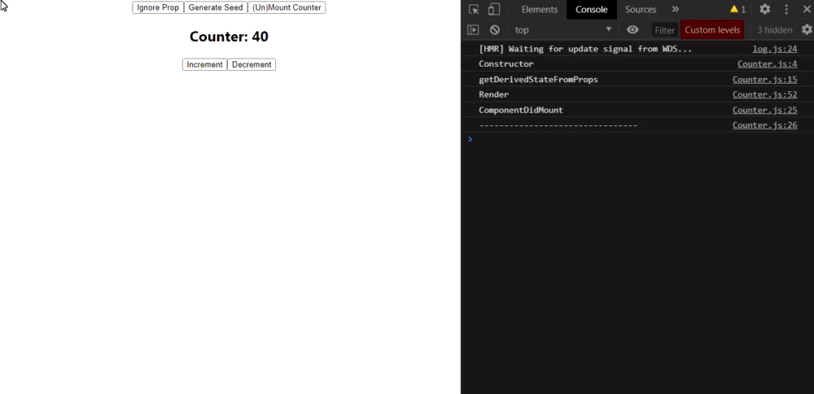
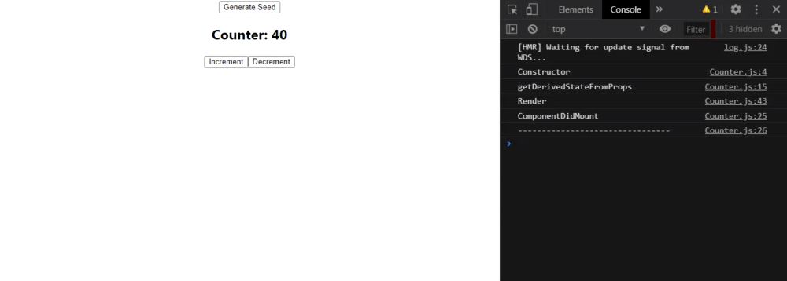
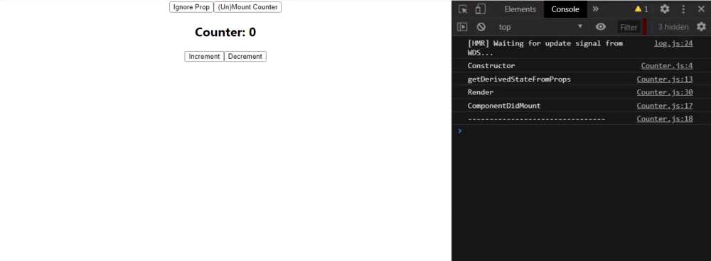

# Component Lifecycle Methods

**Resources:**  
1. [https://blog.pusher.com/beginners-guide-react-component-lifecycle/](https://blog.pusher.com/beginners-guide-react-component-lifecycle/).
2. [Youtube: ReactJS Tutorial Codevolution](https://www.youtube.com/watch?v=qnN_FuFNq2g&list=PLC3y8-rFHvwgg3vaYJgHGnModB54rxOk3&index=22)
3. [React Component Lifecycle - Hooks / Methods Explained](https://www.youtube.com/watch?v=m_mtV4YaI8c&t=1289s)

A demo of the code snippet I've created to better understand component lifecycle methods:  




## Mounting Phase Lifecycle Methods
### 1. constructor(props)
- It is a special function that gets called whenever a new component is created.  
- **USE this for:**  
  - Initializing state
  - Binding event handlers  
- **DON'T use it for:**  
  - causing side effects like HTTP requests
- Call `super(props)` to call the base class constructor. We can use `this.props` only after we have called `super(props)`.
- Constructor is the only place where you're expected to change or set the state by directly overwriting `this.state`. In all other scenarios we have to use `this.setState()`

### 2.static getDerivedStateFromProps(props,state)
- rarely used lifecycle method
- used when the state of the component depends on changes in props over time and allows you to sync the state.
- Since its a static method, it does not have access to the `this` keyword.
- Since we cannot call `this.setState` in this method, we have to return an object that represents the new state of the component.
- **DO NOT** cause side effects.

### 3. render()
- It is the **only required** method in a Class Component.
- we read `this.props` and `this.state` and return JSX which describes the UI.
- It is a pure function. For the given props and state, it should always render the same UI.
- **DO NOT** change state or interact with DOM or make AJAX calls.
- After the parent render, the Children components lifecycle methods are executed.

### 4. componentDidMount
- called only once in the whole lifecycle of a given component.
- Invoked immediately after a component and all its children components have been rendered to the DOM.
- **Cause Side Effects** Ex: Interact with the DOM or perform any AJAX calls to load data.

An example demonstrating component mounting lifecycle methods:  

**`App.js`**
```javascript
import React, { Component } from 'react';
import './App.css';
import Counter from './Counter';

class App extends React.Component {
  render(){
    return (
      <div className="App">
        <Counter />
      </div>
    );
  }
  
}
export default App;
```
**`Counter.js`**
```javascript
import React, { Component } from 'react';

class Counter extends Component {
    constructor(props) {
        console.log("Constructor");
        super(props);
        this.state = { 
            counter: 0
         }
         this.increment = () => this.setState({counter: this.state.counter + 1});
         this.decrement = () => this.setState({counter: this.state.counter - 1});
    }
    static getDerivedStateFromProps(props, state){
        console.log('getDerivedStateFromProps')
        return null
    }
    componentDidMount(){
        console.log("ComponentDidMount")
        console.log("--------------------------------")
    }
    render() { 
        console.log("Render");
        return ( 
            <div>
                <div className="counter">
                    <h2>Counter: {this.state.counter}</h2>
                </div>
                <button onClick={this.increment}>Increment</button>
                <button onClick={this.decrement}>Decrement</button>
            </div>
         );
    }
}
export default Counter;
```


---------------------------------------------------------------------------------------------------------------------------------------
## Updating Phase Lifecycle Methods
### 1. static getDerivedStateFromProps(props,state)
- This method is called every time a component is re-rendered.
- **DO:** Set the state
- **DON'T:** Cause side effects
- rarely used method in the updating phase

Example: we add a method generateSeed() in App.js that allows us to pass any random seed value.
```javascript
static getDerivedStateFromProps(props, state){
    //gives you a chance to copy any values from props that you maybe interested in transferring over to state
    console.log('getDerivedStateFromProps')
    if(props.seed && state.seed !== props.seed){
        return{
            seed: props.seed,
            counter: props.seed
        }
    }
    return null //if you don't want to change state
}
```


### 2. shouldComponentUpdate(nextProps, nextState)
- This method receives the updated props and state
- Dictates if the component should re-render or not.
- By default all class components will re-render whenever the props they receive or their state changes. This method can prevent that default behaviour by returning false.
- We can compare the existing props and state values with the next props and state values and return true or false to let React know whether the component should update or not.
- This method is basically for performance optimization.
- **DON'T:** Cause side effects or call the setState() method.
- rarely used lifecycle method.

- To demonstrate this method, we pass an `ignoreProp` prop to the Counter. Normally when we click the button, render and componentDidUpdate is called. But, let's ay we want to ignore the ignoreProp, we don't want to render it as we're not rendering it to the UI(it does not  change anything on the screen).
- So we create a condition inside `shouldComponentUpdate` method to tell React when its appropriate to not call render.
```javascript
shouldComponentUpdate(nextProps, nextState){
    //we're not doing anything with ignoreProp, we're not rendering it to the UI, so we want to ignore it
    if(nextProps.ignoreProp && this.props.ignoreProp !== nextProps.ignoreProp){
        console.log("shouldComponentUpdate --- DO NOT RENDER")
        return false;
    }
    console.log("shouldComponentUpdate --- RENDER")
    return true;
}
```


### 3. render()
- same description as in mounting lifecycle methods

### 4. getSnapshotBeforeUpdate(prevProps, prevState)
- called right before the changes from the virtual DOM are to be reflected in the DOM.
- This method allows us to capture some properties that are not stored in the state before we re-render that component.
- **DO:** Capture some information from the DOM. Example: Read the user's scroll position and after the update, maintain that scroll position by performing some calculations.
- This method returns either null or returns a value. Returned value will be passed as the third parameter to the next method.
- Rarely used method

### 5.componentDidUpdate(prevProps, prevState, snapshot)
- Called after the render is finished in the re-render cycles. This means you can be sure that the component and all its sub components have properly rendered itself after the update.
- This method is guaranteed to be only called once in each re-render cycle.
- **you can CAUSE SIDE EFFECTS**
- So you can make ajax calls but before making the call you need to compare the prevProps the newProps and then decide whether to make the Ajax call or not.

----------------------------------------------------------------------------------------------------------------------------------------
### Component Unmounting Lifecycle Method
#### componentWillUnmount()
- This method is invoked immediately before a component is unmounted and destroyed.
- **DO:** Perform cleanup tasks like cancelling any network requests, removing event handlers, cancelling any subscriptions and invalidating timers.
- **DON'T:** Call the setState() method. Because a component is never re-rendered after it has unmounted.

## Error Handling Phase Lifecycle Methods
These two methods are called when there is an error either during rendering, in a lifecycle method, or in the constructor of any child component.
#### 1. static getDerivedStateFromError(error)
#### 2. componentDidCatch(error, info)
- This lifecycle method was added in React 16 and is used in error boundaries.
- A component becomes an error boundary if it defines the componentDidCatch method.
- In this method, `this.setState` can be called and used to catch an unhandled JavaScript error in a child component tree and display a fallback UI instead of the component that crashed. 
- These errors are caught during rendering, in lifecycle methods, and in constructors of the whole tree below them. This is to ensure that an error in a child component does not break the whole app.

> **NOTE:**  This method only catches errors in child components and not in the component itself.

