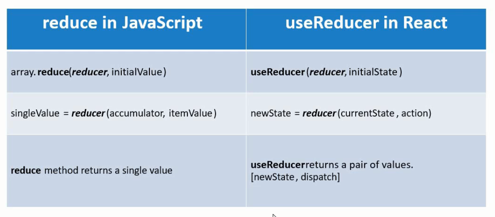

# useReducer Hook

- useReducer is a hook that is used for state management.
- It is an alternative to useState.
- What's the difference between useState and useReducer? useState is built using useReducer. So, useReducer is a more primitive hook as compared to useState.
- When should I use useState or useReducer? We will be able to answer this question after we have an understanding about usereducer.

#### What is a reducer?
- useReducer is related to reducers. 
- we have learnt about the reduce array function in vanilla Javascript.
- The reduce() method executes a reducer function(that you provide) on each element of the array, resulting in a single output value.   
Example:

```Javascript
const array1 = [1, 2, 3, 4];
const reducer = (accumulator, currentValue) => accumulator + currentValue;

// 1 + 2 + 3 + 4
console.log(array1.reduce(reducer));
// expected output: 10

// 5 + 1 + 2 + 3 + 4
console.log(array1.reduce(reducer, 5));
// expected output: 15

```

- The reduce method takes two parameters: 
1. first parameter is the reducer function and
2. second parameter is an initial value that the reducer function can make use of.

- The reducer function itself accepts two parameters(accumulator and currentValue) and reduces them down to a single value and then returns that value.



## useReducer (simple state & action)
- Lets take help of an example to understand the useReducer hook. We will re-create the Counter example for this.
- Create Increment, decrement and reset buttons inside CounterOne.js.
- Next we need a count variable, that can be displayed in the JSX and this is where we need useReducer.   

#### STEPS:
1. Import useReducer from React.
2. Define the initial state and the reducer function. We'll define them outside the component.
  - The reducer function accepts the currentState and returns the newState. But for this transition to happen, we need something and that is the action parameter. You can think of action as an instruction to the reducer function. Based on what the action specifies, the reducer function performs the necessary state transition.
  - For our example, we can have three actions: increment, decrement, and reset. So, within the reducer function body, we'll add a switch statement.
3. Get hold of a value to display in JSX and we also need a way to call the reducer function with the appropriate action.
- Similar to useState, useReducer also returns a pair of values which we can get hold of using the array destructuring syntax.
- So, useReducer returns currentState(which we have called count) and a dispatch method. This dispatch method allows us to execute the code corresponding to a particular action.
- So, now display the Count value in the JSX and add the click handlers for the three buttons.
- For, increment button, we dispatch the increment action, for decrement we dispatch athe decrement action and so on. So, the argument to the dispatch method is the action specified in the reducer function.

#### App.js
```Javascript
import React from 'react';
import './App.css';
import CounterOne from './components/CounterOne'

function App() {
  return (
    <div className="App">
      <CounterOne />
    </div>
  );
}

export default App;

```

#### CounterOne.js
```Javascript
import React, {useReducer} from 'react';

const initialState = 0
const reducer = (state, action) => {
    //return newState
    switch(action){
        case 'increment':
            return state + 1
        case 'decrement':
            return state - 1
        case 'reset':
            return initialState
        default:
            return state
    }
}
const CounterOne = () => {
    const [count, dispatch] = useReducer(reducer, initialState)
    return ( 
        <div>
            <h2>Count - {count}</h2>
            <button onClick={() => dispatch('increment')}>Increment</button>
            <button onClick={() => dispatch('decrement')}>Decrement</button>
            <button onClick={() => dispatch('reset')}>Reset</button>
        </div>
     );
}
 
export default CounterOne;
```
---------------------------------------------------------------------------------------------------------------------------------------------------------------------------------

## useReducer (complex state & action)
- Instead of making use of a simple state and action, we will be using a state object and an action object.
- Create a new file CounterTwo.js and copy the code of CounterOne.js inside it and rename the component to CounterTwo.

#### CHANGES IN CounterTwo.js
1. Convert simple numeric state into an object. The object initialCount will contain a property called firstCounter which is 0. And update the count value in JSX
```Javascript
   const initialState = {
       firstCounter: 0
   }
   // In JSX
   <h2>Count - {count.firstCounter}</h2>
```
2. Convert simple string action into an object. The object will contain a property called type which is a string.
```Javascript
   const reducer = (state, action) => {
     switch(action.type){
    ...
    }
   // In JSX
   <button onClick={() => dispatch({type: 'increment'})}>Increment</button>
   <button onClick={() => dispatch({type: 'decrement'})}>Decrement</button>
   <button onClick={() => dispatch({type: 'reset'})}>Reset</button>
```
3. For increment and decrement actions, we now need to return the new state object.
```Javascript
    switch(action.type){
        case 'increment':
            return { firstCounter: state.firstCounter + 1 }
        case 'decrement':
            return { firstCounter: state.firstCounter - 1}
        case 'reset':
            return initialState
        default:
            return state
    }
```

#### CounterTwo.js
```Javascript
import React, {useReducer} from 'react';

const initialState = {
    firstCounter: 0
}
const reducer = (state, action) => {
    //return newState
    switch(action.type){
        case 'increment':
            return { firstCounter: state.firstCounter + 1 }
        case 'decrement':
            return { firstCounter: state.firstCounter - 1}
        case 'reset':
            return initialState
        default:
            return state
    }
}
const CounterTwo = () => {
    const [count, dispatch] = useReducer(reducer, initialState)
    return ( 
        <div>
            <h2>Count - {count.firstCounter}</h2>
            <button onClick={() => dispatch({type: 'increment'})}>Increment</button>
            <button onClick={() => dispatch({type: 'decrement'})}>Decrement</button>
            <button onClick={() => dispatch({type: 'reset'})}>Reset</button>
        </div>
     );
}
 
export default CounterTwo;
```
